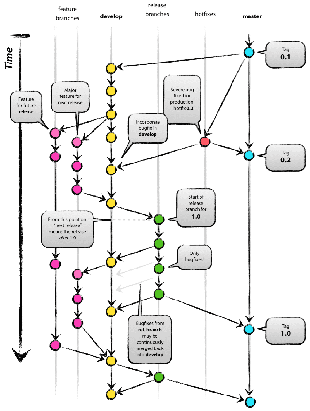

A git Branching Methodology
===========================

`gitflow` Intro
---------------

    `gitflow <http://nvie.com/posts/a-successful-git-branching-model/>`_ is a git branching methodology that Vincent Driessen created and has been adopted by many companies with great success. Atlassian even covers gitflow in their `git tutorials <https://www.atlassian.com/git/tutorials/comparing-workflows/gitflow-workflow>`_.

Branches
--------

    * ``master``

        ``master`` is master. ;) It will have anything that is in production.
        
    * ``develop``

        This branch for the most part parallels ``master`` and is kept up-to-date.
        

    * ``feature/{feature_name}``

        This branch contains a new feature to be introduced within the codebase.

        
    * ``release/{version_number}``
    
        This branch is prepared after feature, bugfix, et cetera branches are merged into the ``develop`` branch. Essentially, a release is prepared after a developer finishes work in dev and is ready to have it sent to QA.
        
    * ``hotfix/{hotfix_name}``

        This branch is used for any bugfixes that are usually found after a release that are necessary to be rolled out as top priority.
        
    * ``bugfix/{bugfix_name}``

        Bugfix branches are coupled with release/* branches. During QA if there are bugs that need to be addressed, a `bugfix` branch will be used to merge into the `release` branch and the `develop` branch.

    
    Credit: nvie.com
    
    
Environments
------------

    These are the typical environments that are used within any sofware development cycle.

    * Dev
    
        ``develop``

    * QA

    * Production

Usage
-----

    * New feature during a sprint/dev-cycle

        Development on a new feature will start by branching off of the ``develop`` branch. After development is complete, the ``feature`` branch is merged `back` into the `develop` branch.
        
        ** Note: ``feature`` branches do `not` get deleted until the release it will be in gets merged into ``master``
     

    * Creating a release

        After all of the development on any feature branches are complete and they are merged back into the `develop` branch, you can branch off of the ``develop`` branch to create a ``release`` branch.

        At this stage is where you will decide on the version number and also begin QA.
        
    * Bugfix found during QA

        A ``bugfix`` branch is used to address any bugs found during QA. This branch is created by branching off of the respective ``release`` branch from which the bug was found.

        After development is complete, the ``bugfix`` branch gets merged back into its respective ``release`` branch `and` the ``develop`` branch.
        
    * Creating a hotfix
    
        A ``hotfix`` branch is created by branching off of ``master`` or the latest ``tag``. So essentially, whatever is live in production already. A version bump can be done in the ``hotfix`` branch in lieu of creating a ``release`` branch.
        
    * Tagging

        A tag is created after the ``release`` branch is QA'd and merged into ``master``. 
        
        
        
Example Scenarios
-----------------

    * Two developers, same codebase
    
        During a sprint/dev-cycle, two developers need to work on features that are in the same codebase. Both developers clone the repository and both create their respective branches off of the latest ``develop`` branch.
        
        After the ``feature`` branches are done, they are merged back into ``develop``.
        
        A ``release`` branch is created by one person who will branch off of ``develop`` since it has all of the completed features.
        
        The ``release`` branch can now be sent over for QA.
        
        After QA passes, a production rollout can take place; the ``release`` branch can be merged into ``master`` `and` ``develop``.
        
        
    * Bug found in QA
    
        During QA, if a bug is found, a ``bugfix`` branch can be created by branching off of the ``release`` branch in which the bug came from. The ``bugfix`` branch is then merged into the ``release`` branch again.
        
    
    * Critical bug found after production rollout

        If a bug has been found after a release has been rolled out in production and development has already started for another dev-cycle, a ``hotfix`` branch can be used.
        
        The ``hotfix`` branch branches off of ``master`` (or the latest tag). After development is done, the ``hotfix`` branch gets merged into ``master`` `and` ``develop``.
        
        Other development in the dev-cycle can continue as normal since the ``hotfix`` branch is branched off of ``master``.
        
        
    * Cherry picking features

        As mentioned earlier, ``feature`` branches do `not` get deleted until the ``release`` branch they are in are merged into ``master``. Keeping these branches around until then allow features to be cherry picked. 
        
        There will be some instances where some features need to be delivered faster than others. In this case, it would be suitable to create a release with only the features wanted; the remaining features can be released in another ``release`` branch.
